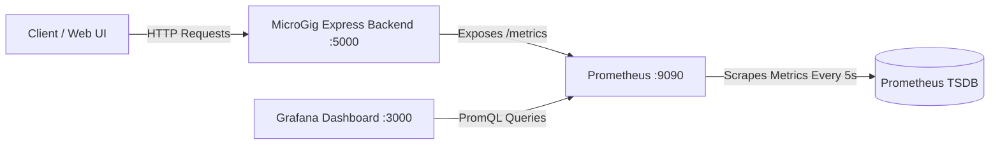

# 📊 MicroGig (gigly) - Grafana & Prometheus Observability Guide

This directory contains full observability instrumentation for the **MicroGig** application backend using **Prometheus** for metrics collection and **Grafana** for real-time visual dashboards.

---

## 🏗️ Observability Architecture



---

## 🚀 Quick Start Guide

### Option 1: Full Docker Compose Stack (API + Prometheus + Grafana)

Ensure Docker Desktop is running on your host machine, then run:

```bash
docker compose up -d
```

Access the services:
- **Grafana Dashboard:** [http://localhost:3000](http://localhost:3000) (Username: `admin`, Password: `admin`)
- **Prometheus UI:** [http://localhost:9090](http://localhost:9090)
- **API Metrics Endpoint:** [http://localhost:5000/metrics](http://localhost:5000/metrics)

---

### Option 2: Running Node.js App Locally + Dockerized Monitoring

If you prefer running your Node.js backend locally with `npm run dev`:

1. Start your local Express server:
   ```bash
   cd server
   npm run dev
   ```
2. Start Prometheus & Grafana in Docker:
   ```bash
   docker compose up -d prometheus grafana
   ```
   *Prometheus is pre-configured to scrape `host.docker.internal:5000/metrics` automatically.*

---

## 📈 Pre-Configured Grafana Dashboard

Grafana is automatically pre-provisioned with the **MicroGig (gigly) System Observability** dashboard (`gigly-observability-dashboard`). No manual setup is required!

### Key Dashboard Panels:

| Panel | Metric | Description |
|---|---|---|
| **Active In-Flight Requests** | `gigly_http_active_requests` | Gauge showing active requests currently being processed |
| **Total Request Rate (RPS)** | `sum(rate(gigly_http_requests_total[1m]))` | Real-time Requests Per Second |
| **p95 Request Latency** | `histogram_quantile(0.95, ...)` | 95th percentile API response time in milliseconds |
| **Node.js Heap Memory** | `gigly_nodejs_heap_size_used_bytes` | Express process V8 heap memory usage |
| **HTTP Traffic by Route** | `gigly_http_requests_total` by `route` & `method` | Per-endpoint request distribution |
| **Status Code Distribution** | `gigly_http_requests_total` by `status_code` | Breakdown of 2xx, 4xx, and 5xx HTTP responses |
| **Latency Percentiles (p50, p95, p99)** | `gigly_http_request_duration_seconds_bucket` | Response time distributions |
| **System Memory & Event Loop** | `gigly_process_resident_memory_bytes` | RSS Memory and Event Loop Lag metrics |

---

## 🧪 Testing Metrics Generation

To generate test metric data and see live charts in Grafana:

1. Send requests to the health check endpoint:
   ```bash
   curl http://localhost:5000/api/health
   ```
2. View raw Prometheus metrics in your browser or curl:
   ```bash
   curl http://localhost:5000/metrics
   ```
3. Open Grafana at `http://localhost:3000` to inspect real-time visual charts.
